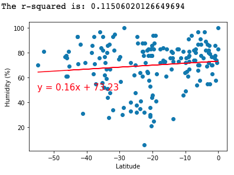

# Global Weather Analysis

## Background
"What's the weather like as we approach the equator?" Now, we know what you may be thinking: _"Duh. It gets hotter..."_
But, if pressed, how would you **prove** it?

## WeatherPy
I created a Python script to visualize the weather of 500+ cities across the world of varying distance from the equator. To accomplish this, I utilized a [simple Python library](https://pypi.python.org/pypi/citipy), the [OpenWeatherMap API](https://openweathermap.org/api), and a little common sense to create a representative model of weather across world cities.

Here are a few series of scatter plots to showcase the following relationships:

#### Temperature (F) vs. Latitude

#### Humidity (%) vs. Latitude

#### Cloudiness (%) vs. Latitude

#### Wind Speed (mph) vs. Latitude

Next I ran linear regression on each relationship, only this time separating them into Northern Hemisphere (greater than or equal to 0 degrees latitude) and Southern Hemisphere (less than 0 degrees latitude):

#### Northern Hemisphere - Temperature (F) vs. Latitude

####  Southern Hemisphere - Temperature (F) vs. Latitude

####  Northern Hemisphere - Humidity (%) vs. Latitude

####  Southern Hemisphere - Humidity (%) vs. Latitude

####  Northern Hemisphere - Cloudiness (%) vs. Latitude

####  Southern Hemisphere - Cloudiness (%) vs. Latitude

####  Northern Hemisphere - Wind Speed (mph) vs. Latitude

####  Southern Hemisphere - Wind Speed (mph) vs. Latitude

### Conclusion
1) As expected, the weather becomes significantly warmer as one approaches the equator (0 Deg. Latitude). More interestingly, however, is the fact that the southern hemisphere tends to be warmer this time of year than the northern hemisphere. This may be due to the tilt of the earth.
2) There is no strong relationship between latitude and cloudiness. However, it is interesting to see that a strong band of cities sits at 0, 80, and 100% cloudiness.
3) There is no strong relationship between latitude and wind speed. However, in northern hemispheres there is a flurry of cities with over 20 mph of wind.

## VacationPy
Now I used the skills in working with weather data to plan future vacations. I used jupyter-gmaps and the Google Places API for this part of the analysis.

### Heat map that displays the humidity for every city from the WeatherPy

I then narrowed down the DataFrame to find my ideal weather conditions:
- A max temperature lower than 80 degrees but higher than 70.
- Wind speed less than 10 mph.
- Zero cloudiness.
- Dropped any rows that don't contain all three conditions. I wanted to be sure the weather is ideal.

Used Google Places API to find the first hotel for each city located within 5000 meters of your coordinates.

### Humidity heatmap overlayed with pins containing the **Hotel Name**, **City**, and **Country**.

